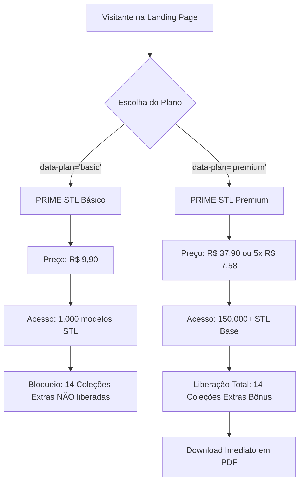
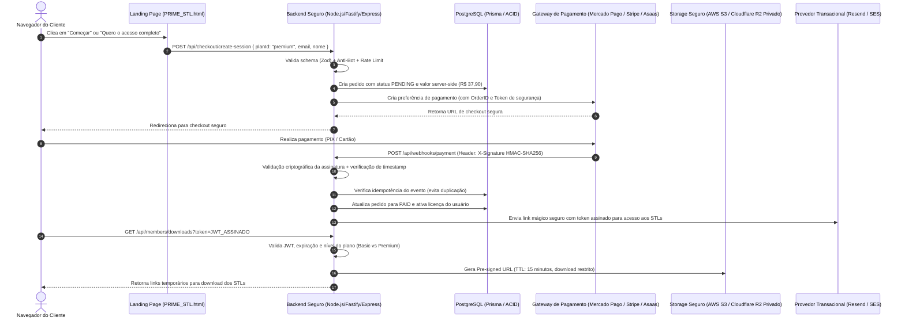
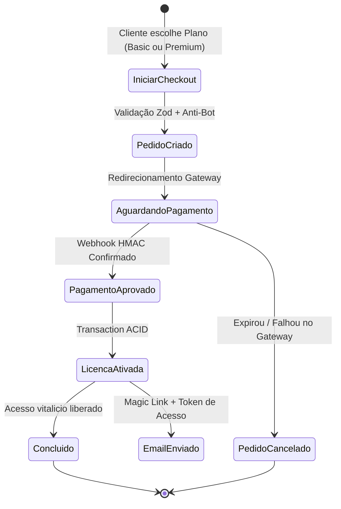

# CÉREBRO DO PROJETO: PRIME STL
> **Documento Mestre de Regras de Negócio, Arquitetura Full Stack & Segurança Máxima**  
> **Status:** Referência Canônica de Engenharia  
> **Classificação:** Site de Compras Simples / Conteúdo Digital com Blindagem Nível Produção  

---

## Atualização de 07/10/2026

- Adicionado o vídeo oficial de apresentação da PRIME STL (`Apresentação.mp4` / 4K Ultra HD, 2min 25s) posicionado estrategicamente logo após a primeira apresentação do site (Hero e barra de benefícios).
- Player nativo HTML5 de alta performance com controles completos (`controls`, `playsinline`, `preload="metadata"`), moldura cinema escura com iluminação sutil e suporte responsivo a todos os dispositivos (desktop e mobile).
- Compatibilidade multiplataforma com fallbacks de URL ASCII e UTF-8 (`apresentacao/apresentacao.mp4` e `apresentação/Apresentação.mp4`), servidos de forma estática sem sobrecarga.
- Links de acesso rápido adicionados ao menu de navegação do cabeçalho e na chamada de ação principal do Hero ("Assistir à apresentação").
- Adicionado na Área do Cliente (`/painel`) o **Pack de Agradecimento (Bônus Exclusivo)** para todos os compradores (Básico e Premium), com download direto do PDF (`PRIME STL Pack Agradecimento.pdf`) e link para a pasta de STL bônus no Google Drive, implementado 100% no frontend sem alterar o backend já consolidado.
- Resolvido o erro de build da Vercel (`ENOENT: /vercel/path0/apresentacao`) através da remoção de junções NTFS de ambiente local Windows, padronização do diretório estático `public/apresentacao` e arquitetura híbrida de streaming `pages/index.js` + App Router. Deploy de produção ativo e validado em `https://www.primestl3d.com.br/`.

## Atualização de 01/10/2026

- Plano Básico: R$ 9,90, com 1.000 modelos STL.
- Plano Premium: R$ 37,90 ou 5× de R$ 7,58 sem juros.
- Removidos o vídeo de apresentação e o tour externos, seus botões, URLs e código de reprodução.
- Preservada a animação 3D própria da abertura.

## 1. VISÃO GERAL & DIRETRIZES FUNDAMENTAIS

### 1.1. O que é o PRIME STL
O **PRIME STL** é uma plataforma e landing page de comércio eletrônico voltada para a comercialização de arquivos digitais tridimensionais (modelos fatiáveis no formato `.STL`) para impressão 3D (FDM e Resina).  
O site opera como um comércio digital simples: catálogo de produtos, páginas de conversão, checkout integrado com gateway de pagamento seguro, processamento assíncrono de webhook, emissão de credenciais temporárias de acesso/download e entrega segura de ativos digitais.

### 1.2. Princípio da Imutabilidade da Base Visual do Site
Conforme diretriz estrita do projeto:
- O layout visual, hierarquia de componentes e scripts interativos do arquivo `PRIME_STL.html` são preservados integralmente.
- Todas as implementações de backend, integrações de APIs, banco de dados, regras de checkout, middlewares de segurança e serviços auxiliares devem se plugar de forma modular, respeitando as marcações semânticas e contratos de dados já expostos pelo HTML (ex.: atributos `data-plan`, `data-model`, seletores de modal e configurações `PRIME_CONFIG`).

### 1.3. Domínio Oficial e Configurações de Rede
- **Domínio Canônico:** `https://www.primestl3d.com.br/`
- **Protocolo Obrigatório:** HTTPS forçado (TLS 1.3). Qualquer tráfego recebido em `http://www.primestl3d.com.br/` ou `http://primestl3d.com.br/` deve responder com redirecionamento permanente HTTP 301 para `https://www.primestl3d.com.br/` com cabeçalho HSTS ativo. Isso é indispensável para evitar que navegadores exibam alertas de "Site Não Seguro" durante o processo de compra.

---

## 2. MAPEAMENTO INTEGRAL DO PRODUTO & REGRAS DE NEGÓCIO (BASEADO NO HTML)

### 2.1. Catálogo e Produtos em Destaque
O catálogo inicial mapeado no frontend divide-se em 4 eixos principais de navegação:

| Modelo / Item | Categoria Técnica | Grupo (`data-filter`) | Ativo de Imagem |
| :--- | :--- | :--- | :--- |
| **Goku Kid** | Personagens · STL | `personagens` | `goku_kid.webp` |
| **Gotenks Kid** | Personagens · STL | `personagens` | `gotenks.webp` |
| **Luminárias decorativas** | Design & decoração · STL | `decoracao` | `luminarias.webp` |
| **Veículos em miniatura** | Colecionáveis · STL | `colecionaveis` | `veiculos.webp` |
| **Spawn** | Personagens · STL | `personagens` | `spawn.webp` |
| **Shadow** | Personagens · STL | `personagens` | `shadow.webp` |
| **Sub-Zero** | Personagens · STL | `personagens` | `sub_zero.webp` |
| **Lego Batman** | Colecionáveis · STL | `colecionaveis` | `model_1.webp` |

### 2.2. Nichos & Categorias Mapeadas
A biblioteca estrutura os seguintes 11 nichos de navegação:
1. `Luminárias` (Design & Decoração)
2. `Veículos 3D` (Colecionáveis)
3. `Heróis Marvel` (Universo Geek)
4. `Chaveiros` (Pequenas Criações)
5. `Articulados` (Design em Movimento)
6. `Pokémon 3D` (Colecionáveis)
7. `Cosplay & Máscaras` (Criações em Escala)
8. `Copa do Mundo` (Temas Esportivos)
9. `Mascotes Esportivos` (Paixão pelo Esporte)
10. `Clássicos dos Desenhos` (Memória & Nostalgia)
11. `Amigurumi 3D` (Texturas & Personagens)

### 2.3. As 14 Coleções Extras (Exclusivas do Plano Premium)
O diferencial central do plano Premium é a concessão de 14 coleções adicionais (bônus):
1. **Veículos 3D:** +172 veículos em escala.
2. **Heróis da Marvel:** +150 modelos de personagens.
3. **Chaveiros Criativos:** +500 ideias de impressão rápida.
4. **Flexíveis & Articulados:** +1.300 modelos mecânicos fatiáveis.
5. **Clássicos dos Desenhos:** Modelos nostálgicos.
6. **Cosplay 3D:** +200 peças, elmos e máscaras funcionais.
7. **Coleção Pokémon:** +450 modelos com alta demanda.
8. **Especial de Natal:** Decorações e enfeites temáticos.
9. **Copa do Mundo:** Troféus e adereços esportivos.
10. **Mascotes Esportivos:** Conexão regional e torcidas.
11. **Luminárias STL:** +250 modelos para iluminação LED/abajur.
12. **Amigurumi 3D:** +200 modelos em textura imitando crochê.
13. **Coleção Lego 3D:** Minifiguras e organizadores compatíveis.
14. **Universo Minecraft:** Personagens, ferramentas e blocos modulares.

### 2.4. Matriz de Planos, Preços e Acessos
As regras comerciais extraídas do HTML devem ser mantidas de forma rígida pelo backend:



#### Regras Financeiras Inegociáveis:
1. **Preço do Plano Básico:** `R$ 9,90` (centavos: `990`). Pagamento único vitalício, com acesso a 1.000 modelos STL e sem as 14 coleções extras.
2. **Preço do Plano Premium:** `R$ 37,90` (centavos: `3790`). Pagamento único ou parcelado em até 5x de R$ 7,58.
3. **Âncora de Preço:** Exibição do valor original de `R$ 197,00` cortado no Premium.
4. **Regra de Validação de Preço:** O cliente **NUNCA** envia o valor da compra. O cliente apenas submete o identificador de plano (`basic` ou `premium`). A consulta e precificação ocorrem exclusivamente na camada segura do servidor.
5. **Produto Digital de Consumo Imediato:** Entrega digital imediata de ativos (arquivos .STL e guias em PDF) liberados no ato da confirmação do pagamento, sem política de garantia ou reembolso posterior.

---

## 3. ARQUITETURA FULL STACK & FLUXO DE COMPRA SEGURO

### 3.1. Visão Arquitetural do Sistema



---

## 4. MODELO DE AMEAÇAS & REQUISITOS DE SEGURANÇA MÁXIMA

Por ser um site de compras de produtos digitais, o PRIME STL é alvo de ataques específicos que foram mapeados e blindados:

| Vetor de Ameaça | Cenário de Risco | Medida de Segurança Máxima Obrigatória |
| :--- | :--- | :--- |
| **Price Tampering (Adulteração de Preço)** | Atacante intercepta o POST e altera o valor do plano de R$ 37,90 para R$ 0,01. | Preço derivado **exclusivamente no servidor** com base na chave `planId` validada por enum restrito. |
| **Webhook Spoofing (Falsificação de Pagamento)** | Atacante envia um POST manual para a rota de webhook fingindo que o pagamento foi aprovado. | Assinatura HMAC SHA-256 obrigatória. Requisições sem assinatura válida são rejeitadas com HTTP 401 e logadas. |
| **Webhook Replay Attack** | Atacante captura um webhook legítimo de R$ 9,90 e reenvia para forçar nova ativação ou créditos. | Registro de cada `event_id` processado em tabela de idempotência + verificação de janela de tolerância de tempo (máx 5 minutos). |
| **Hotlinking & Vazamento dos Arquivos STL** | URLs de download dos arquivos .STL são compartilhadas em fóruns ou redes sociais. | Bucket S3/R2 **100% privado**. Downloads via URLs pré-assinadas com TTL curto (15 min) atreladas à sessão/token do comprador. |
| **Account Scraping / Download Massivo** | Comprador cria robô para baixar 150.000 arquivos em segundos, gerando custo abusivo de egress. | Rate limiting rigoroso por IP e usuário no endpoint de geração de link de download (ex.: máx 20 downloads por hora). |
| **Card Testing / Ataque de Força Bruta no Checkout** | Bots testam cartões clonados gerando milhares de pedidos pendentes por minuto. | Rate limit rigoroso (máx 5 criações de checkout por IP a cada 10 min) + validação Cloudflare Turnstile / Captcha. |
| **DOM-based XSS no Frontend** | Injeção de scripts maliciosos através do `dialogBody.innerHTML`. | Sanitização estrita antes de qualquer injeção no DOM + Content Security Policy (CSP) sem `unsafe-eval`. |
| **IDOR (Insecure Direct Object Reference)** | Usuário do Plano Básico manipula o ID do arquivo para baixar uma das 14 Coleções Extras. | O backend valida as permissões do plano (`USER_ROLE.BASIC` vs `USER_ROLE.PREMIUM`) antes de gerar o download. |

---

## 5. ESPECIFICAÇÃO DAS REGRAS TÉCNICAS E IMPLEMENTAÇÃO SEGURA

Abaixo constam as regras e o código de referência que todo desenvolvedor ou agente deve seguir para implementar os serviços do PRIME STL sem alterar o HTML.

### 5.1. Esquema do Banco de Dados (Prisma ORM / PostgreSQL)

```prisma
datasource db {
  provider = "postgresql"
  url      = env("DATABASE_URL")
}

generator client {
  provider = "prisma-client-js"
}

enum PlanTier {
  BASIC
  PREMIUM
}

enum OrderStatus {
  PENDING
  PAID
  REFUNDED
  FAILED
  CHARGEBACK
}

enum PaymentMethod {
  PIX
  CREDIT_CARD
  BOLETO
}

model User {
  id            String         @id @default(uuid())
  email         String         @unique
  name          String
  cpf           String?        // Obrigatório para gateways nacionais (criptografado em repouso)
  createdAt     DateTime       @default(now())
  updatedAt     DateTime       @updatedAt
  orders        Order[]
  licenses      License[]
  downloadLogs  DownloadLog[]

  @@index([email])
}

model Order {
  id              String        @id @default(uuid())
  userId          String
  plan            PlanTier
  amountInCents   Int           // 990 para BASIC, 3790 para PREMIUM
  status          OrderStatus   @default(PENDING)
  gateway         String        // ex: 'mercadopago', 'stripe', 'asaas'
  gatewayOrderId  String?       @unique
  paymentMethod   PaymentMethod?
  createdAt       DateTime      @default(now())
  updatedAt       DateTime      @updatedAt

  user            User          @relation(fields: [userId], references: [id], onDelete: Cascade)
  license         License?

  @@index([userId])
  @@index([status])
  @@index([gatewayOrderId])
}

model License {
  id            String      @id @default(uuid())
  userId        String
  orderId       String      @unique
  plan          PlanTier
  isActive      Boolean     @default(true)
  expiresAt     DateTime?   // null = vitalício
  grantedAt     DateTime    @default(now())
  revokedAt     DateTime?

  user          User        @relation(fields: [userId], references: [id], onDelete: Cascade)
  order         Order       @relation(fields: [orderId], references: [id], onDelete: Cascade)

  @@index([userId, isActive])
}

model WebhookEvent {
  id            String      @id // ID originário do gateway
  gateway       String
  eventType     String
  payloadHash   String      // Hash SHA256 do payload recebido
  processedAt   DateTime    @default(now())

  @@unique([id, gateway])
  @@index([processedAt])
}

model DownloadLog {
  id            String      @id @default(uuid())
  userId        String
  fileKey       String
  ipAddress     String
  userAgent     String
  downloadedAt  DateTime    @default(now())

  user          User        @relation(fields: [userId], references: [id], onDelete: Cascade)

  @@index([userId, downloadedAt])
}
```

---

### 5.2. Validação Rigorosa de DTOs com Zod

```typescript
import { z } from 'zod';

export const CheckoutSessionSchema = z.object({
  plan: z.enum(['basic', 'premium'], {
    errorMap: () => ({ message: 'Plano inválido. Escolha "basic" ou "premium".' }),
  }),
  name: z.string().trim().min(3, 'Nome deve ter no mínimo 3 caracteres').max(120),
  email: z.string().trim().email('E-mail em formato inválido').toLowerCase(),
  cpf: z.string().trim().regex(/^\d{11}$/, 'CPF deve conter exatamente 11 dígitos numéricos'),
  turnstileToken: z.string().min(1, 'Token de verificação anti-bot obrigatório'),
});

export type CheckoutSessionInput = z.infer<typeof CheckoutSessionSchema>;
```

---

### 5.3. Endpoint Seguro de Criação de Checkout (Anti-Tampering)

```typescript
import { Request, Response } from 'express';
import { CheckoutSessionSchema } from './schemas/checkout.schema';
import { prisma } from './lib/prisma';
import { verifyTurnstileToken } from './security/captcha';
import { gatewayClient } from './services/paymentGateway';

// Dicionário canônico e inviolável de preços (CENTAVOS)
const PLAN_PRICING = {
  basic: {
    amountInCents: 990, // R$ 9,90
    title: 'PRIME STL Básico — 1.000 Modelos',
    tier: 'BASIC' as const,
  },
  premium: {
    amountInCents: 3790, // R$ 37,90
    title: 'PRIME STL Premium — 150.000+ Arquivos + 14 Bônus',
    tier: 'PREMIUM' as const,
  },
} as const;

export async function createCheckoutHandler(req: Request, res: Response) {
  try {
    // 1. Validação estrita do payload com Zod
    const parsed = CheckoutSessionSchema.safeParse(req.body);
    if (!parsed.success) {
      return res.status(400).json({ error: 'Dados inválidos', details: parsed.error.format() });
    }

    const { plan, name, email, cpf, turnstileToken } = parsed.data;

    // 2. Proteção Anti-Bot (Cloudflare Turnstile)
    const isValidBotCheck = await verifyTurnstileToken(turnstileToken, req.ip || '');
    if (!isValidBotCheck) {
      return res.status(403).json({ error: 'Falha na verificação de segurança' });
    }

    // 3. Resolução segura de preço no Servidor
    const planConfig = PLAN_PRICING[plan];

    // 4. Criação ou atualização atômica do usuário no banco
    const user = await prisma.user.upsert({
      where: { email },
      update: { name, cpf },
      create: { email, name, cpf },
    });

    // 5. Registro do pedido com status PENDING
    const order = await prisma.order.create({
      data: {
        userId: user.id,
        plan: planConfig.tier,
        amountInCents: planConfig.amountInCents,
        status: 'PENDING',
        gateway: 'mercadopago',
      },
    });

    // 6. Chamada segura ao Gateway com os valores da aplicação (NÃO do cliente)
    const checkoutSession = await gatewayClient.createPreference({
      externalReference: order.id,
      items: [
        {
          id: plan,
          title: planConfig.title,
          unitPrice: planConfig.amountInCents / 100,
          quantity: 1,
        },
      ],
      payer: { email, name, identification: { type: 'CPF', number: cpf } },
      backUrls: {
        success: `${process.env.APP_URL}/obrigado?orderId=${order.id}`,
        failure: `${process.env.APP_URL}/erro-pagamento`,
        pending: `${process.env.APP_URL}/processando-pagamento`,
      },
      autoReturn: 'approved',
    });

    // 7. Atualiza Order com ID da transação
    await prisma.order.update({
      where: { id: order.id },
      data: { gatewayOrderId: checkoutSession.id },
    });

    return res.status(201).json({
      checkoutUrl: checkoutSession.initPoint,
      orderId: order.id,
    });
  } catch (err) {
    console.error('[CHECKOUT_ERROR]', err);
    return res.status(500).json({ error: 'Erro ao gerar checkout seguro' });
  }
}
```

---

### 5.4. Processamento Seguro de Webhook com Criptografia HMAC & Idempotência

```typescript
import { Request, Response } from 'express';
import crypto from 'crypto';
import { prisma } from './lib/prisma';
import { sendDeliveryEmail } from './services/emailService';

const WEBHOOK_SECRET = process.env.GATEWAY_WEBHOOK_SECRET!;

export async function paymentWebhookHandler(req: Request, res: Response) {
  // 1. Obtenção dos headers de assinatura e timestamp
  const signature = req.headers['x-signature'] as string;
  const requestId = req.headers['x-request-id'] as string;

  if (!signature || !requestId) {
    return res.status(401).json({ error: 'Assinatura ou cabeçalhos ausentes' });
  }

  // 2. Verificação Criptográfica HMAC SHA-256
  // O payload bruto (rawBody) DEVE ser usado para garantir integridade byte-a-byte
  const rawBody = (req as any).rawBody;
  const expectedSignature = crypto
    .createHmac('sha256', WEBHOOK_SECRET)
    .update(rawBody)
    .digest('hex');

  const isAuthentic = crypto.timingSafeEqual(
    Buffer.from(signature, 'utf8'),
    Buffer.from(expectedSignature, 'utf8')
  );

  if (!isAuthentic) {
    console.warn(`[SECURITY] Tentativa de webhook fraudulento a partir do IP: ${req.ip}`);
    return res.status(403).json({ error: 'Assinatura inválida' });
  }

  const event = req.body;
  const eventId = event.id || requestId;

  // 3. Garantia de Idempotência: impede ataques de replay e duplicações
  const existingEvent = await prisma.webhookEvent.findUnique({
    where: { id_gateway: { id: eventId, gateway: 'mercadopago' } },
  });

  if (existingEvent) {
    // Evento já computado com sucesso anteriormente. Retornar 200 para cessar retries.
    return res.status(200).json({ status: 'already_processed' });
  }

  // Registra recebimento do evento
  await prisma.webhookEvent.create({
    data: {
      id: eventId,
      gateway: 'mercadopago',
      eventType: event.type || 'payment.update',
      payloadHash: crypto.createHash('sha256').update(rawBody).digest('hex'),
    },
  });

  // 4. Execução de Ações Baseadas no Status do Pagamento
  if (event.action === 'payment.created' || event.type === 'payment') {
    const paymentId = event.data?.id;
    const paymentDetails = await gatewayClient.getPayment(paymentId);

    const orderId = paymentDetails.external_reference;
    const paymentStatus = paymentDetails.status; // 'approved', 'refunded', etc.

    const order = await prisma.order.findUnique({
      where: { id: orderId },
      include: { user: true },
    });

    if (!order) {
      return res.status(404).json({ error: 'Pedido não encontrado' });
    }

    // APROVADO: Concede licença e envia credenciais
    if (paymentStatus === 'approved' && order.status !== 'PAID') {
      await prisma.$transaction([
        prisma.order.update({
          where: { id: order.id },
          data: { status: 'PAID' },
        }),
        prisma.license.upsert({
          where: { orderId: order.id },
          update: { isActive: true },
          create: {
            userId: order.userId,
            orderId: order.id,
            plan: order.plan,
            isActive: true,
          },
        }),
      ]);

      // Envio do e-mail com magic link seguro para download
      await sendDeliveryEmail({
        email: order.user.email,
        name: order.user.name,
        plan: order.plan,
        orderId: order.id,
      });
    }

    // CHARGEBACK / ESTORNO: Revoga licença imediatamente
    if (paymentStatus === 'refunded' || paymentStatus === 'charged_back') {
      await prisma.$transaction([
        prisma.order.update({
          where: { id: order.id },
          data: { status: paymentStatus === 'refunded' ? 'REFUNDED' : 'CHARGEBACK' },
        }),
        prisma.license.updateMany({
          where: { orderId: order.id },
          data: { isActive: false, revokedAt: new Date() },
        }),
      ]);
    }
  }

  return res.status(200).json({ status: 'success' });
}
```

---

### 5.5. Entrega Segura de Arquivos Digitais (.STL) via Pre-signed URLs

Os arquivos `.STL` jamais devem ficar em pastas públicas do servidor web nem em buckets com acesso público. A entrega deve seguir o padrão Pre-Signed URL com validação de permissões por plano (RBAC):

```typescript
import { Request, Response } from 'express';
import { S3Client, GetObjectCommand } from '@aws-sdk/client-s3';
import { getSignedUrl } from '@aws-sdk/s3-request-presigner';
import { prisma } from './lib/prisma';
import jwt from 'jsonwebtoken';

const s3 = new S3Client({
  region: process.env.AWS_REGION!,
  credentials: {
    accessKeyId: process.env.AWS_ACCESS_KEY_ID!,
    secretAccessKey: process.env.AWS_SECRET_ACCESS_KEY!,
  },
});

const BONUS_COLLECTIONS_KEYS = [
  'veiculos-3d', 'herois-marvel', 'chaveiros', 'articulados',
  'desenhos-classicos', 'cosplay-3d', 'pokemon-3d', 'natal-especial',
  'copa-do-mundo', 'mascotes-esportivos', 'luminarias-stl',
  'amigurumi-3d', 'colecao-lego', 'minecraft-universo'
];

export async function requestDownloadUrlHandler(req: Request, res: Response) {
  try {
    const authHeader = req.headers.authorization;
    if (!authHeader?.startsWith('Bearer ')) {
      return res.status(401).json({ error: 'Token de autenticação não fornecido' });
    }

    const token = authHeader.split(' ')[1];
    const decoded = jwt.verify(token, process.env.JWT_SECRET!) as { userId: string };

    const { fileKey } = req.body;
    if (!fileKey || typeof fileKey !== 'string') {
      return res.status(400).json({ error: 'fileKey inválido' });
    }

    // 1. Busca licença ativa do usuário
    const activeLicense = await prisma.license.findFirst({
      where: {
        userId: decoded.userId,
        isActive: true,
      },
    });

    if (!activeLicense) {
      return res.status(403).json({ error: 'Nenhuma licença ativa encontrada ou acesso revogado' });
    }

    // 2. Validação de IDOR e autorização de Bônus:
    // Se o arquivo for de uma das 14 Coleções Extras, requer OBRIGATORIAMENTE o plano PREMIUM
    const isBonusFile = BONUS_COLLECTIONS_KEYS.some((bonus) => fileKey.startsWith(`bonus/${bonus}/`));
    if (isBonusFile && activeLicense.plan !== 'PREMIUM') {
      return res.status(403).json({
        error: 'Este pacote pertence às 14 Coleções Extras exclusivas do plano Premium.',
        upgradeAvailable: true,
      });
    }

    // 3. Rate Limiting por Usuário (Prevenção de Abuso de Banda e Scraping Massivo)
    const oneHourAgo = new Date(Date.now() - 60 * 60 * 1000);
    const recentDownloadsCount = await prisma.downloadLog.count({
      where: {
        userId: decoded.userId,
        downloadedAt: { gte: oneHourAgo },
      },
    });

    if (recentDownloadsCount >= 25) {
      return res.status(429).json({
        error: 'Limite temporário de downloads atingido (máximo 25 por hora). Aguarde para novos downloads.',
      });
    }

    // 4. Geração de URL Pré-assinada com TTL curto (15 minutos)
    const command = new GetObjectCommand({
      Bucket: process.env.S3_PRIVATE_BUCKET_NAME!,
      Key: fileKey,
      ResponseContentDisposition: `attachment; filename="${fileKey.split('/').pop()}"`,
    });

    const signedUrl = await getSignedUrl(s3, command, { expiresIn: 900 }); // 900s = 15min

    // 5. Registro de auditoria do download
    await prisma.downloadLog.create({
      data: {
        userId: decoded.userId,
        fileKey,
        ipAddress: req.ip || '0.0.0.0',
        userAgent: req.headers['user-agent'] || 'unknown',
      },
    });

    return res.status(200).json({
      downloadUrl: signedUrl,
      expiresInSeconds: 900,
    });
  } catch (err) {
    console.error('[DOWNLOAD_ERROR]', err);
    return res.status(500).json({ error: 'Erro ao gerar link seguro de download' });
  }
}
```

---

### 5.6. Hardening de Cabeçalhos HTTP & Content Security Policy (CSP)

Para máxima segurança da aplicação web em produção, os seguintes cabeçalhos devem ser configurados no proxy reverso (Nginx/Cloudflare) ou via middleware `helmet` no backend:

```typescript
import helmet from 'helmet';
import { Express } from 'express';

export function applySecurityHeaders(app: Express) {
  app.use(
    helmet({
      contentSecurityPolicy: {
        directives: {
          defaultSrc: ["'self'"],
          // Permite scripts locais e Three.js inline seguro
          scriptSrc: [
            "'self'",
            "'unsafe-inline'", // Necessário para a execução procedural da Three.js do HTML
            'https://challenges.cloudflare.com', // Cloudflare Turnstile
          ],
          styleSrc: ["'self'", "'unsafe-inline'"],
          imgSrc: ["'self'", 'data:', 'blob:', 'https:'],
          mediaSrc: ["'self'", 'blob:'],
          frameSrc: [
            "'self'",
            'https://challenges.cloudflare.com',
          ],
          connectSrc: [
            "'self'",
            'https://api.mercadopago.com',
            'https://challenges.cloudflare.com',
          ],
          objectSrc: ["'none'"],
          upgradeInsecureRequests: [],
        },
      },
      crossOriginEmbedderPolicy: false, // Permite carregar iframes e vídeos com sandbox
      referrerPolicy: { policy: 'strict-origin-when-cross-origin' },
      hsts: {
        maxAge: 31536000, // 1 ano de HSTS forçado
        includeSubDomains: true,
        preload: true,
      },
      frameguard: { action: 'deny' }, // Anti-Clickjacking
      noSniff: true, // X-Content-Type-Options: nosniff
    })
  );
}
```

---

## 6. SANITIZAÇÃO NO CLIENT-SIDE (PREVENÇÃO DE DOM-XSS)

O script original do HTML possui uma função de exibição de modal:
```javascript
function showDialog(title, content) {
  document.getElementById('dialog-title').textContent = title;
  dialogBody.innerHTML = content;
  dialog.showModal();
}
```
### Regra Estrita de Sanitização:
Caso qualquer conteúdo gerado por usuário ou vindo de parâmetros de URL (`?param=...`) venha a ser injetado no modal, a biblioteca **DOMPurify** deve ser obrigatoriamente utilizada antes de alimentar o `innerHTML`:
```javascript
// Exemplo de injeção blindada:
dialogBody.innerHTML = DOMPurify.sanitize(content, {
  ALLOWED_TAGS: ['b', 'i', 'em', 'strong', 'a', 'p', 'div', 'span', 'h3', 'h4', 'img', 'video', 'iframe', 'button', 'svg', 'use'],
  ALLOWED_ATTR: ['href', 'src', 'alt', 'class', 'onclick', 'controls', 'autoplay', 'playsinline', 'poster', 'title', 'allow', 'allowfullscreen', 'referrerpolicy']
});
```

---

## 7. MÁQUINA DE ESTADOS DA COMPRA & ATIVAÇÃO



---

## 8. CHECKLIST DE IMPLANTAÇÃO E HARDENING DE PRODUÇÃO

Antes de colocar o site de compras em produção:

- [ ] **Variáveis de Ambiente:** Nenhuma chave (`GATEWAY_SECRET`, `JWT_SECRET`, `AWS_SECRET_ACCESS_KEY`) deve estar em arquivos rastreados no Git. Usar `.env` seguro ou Secret Manager.
- [ ] **HTTPS / TLS 1.3:** Forçar redirecionamento HTTP -> HTTPS no servidor web. Certificado SSL ativo com HSTS.
- [ ] **Webhooks com Assinatura:** Garantir que o segredo de webhook do gateway de produção esteja configurado e que rejeite requisições com assinatura divergente.
- [ ] **Auditoria de Preços:** Realizar teste automatizado garantindo que requisições que tentem enviar preços customizados sejam descartadas, usando apenas os valores de `R$ 9,90` e `R$ 37,90`.
- [ ] **Bucket Privado S3/R2:** Verificar se as políticas do bucket bloqueiam qualquer leitura pública anônima (`Block all public access: ON`).
- [ ] **Rate Limiting Ativo:** Middleware de rate limiting ativado para `/api/checkout/*` e `/api/downloads/*`.
- [ ] **Contrato do HTML Preservado:** Nenhuma alteração foi realizada nos arquivos visuais do front-end (`PRIME_STL.html`).
- [ ] **SEO & Schema.org Validado:** Dados estruturados JSON-LD testados no Rich Results Test do Google.

---

## 9. DIRETRIZES DE SEO, GOOGLE SEARCH & RICH SNIPPETS

Para garantir máxima visibilidade orgânica sem degradar a performance visual nem a segurança do site:

1. **Indexação Controlada:**
   - Tag `<meta name="robots" content="index, follow, max-image-preview:large, max-snippet:-1, max-video-preview:-1">` instrui os robôs de busca do Google a indexarem o catálogo com snippets estendidos e prévias visuais em alta resolução.
2. **Dados Estruturados JSON-LD (Schema.org):**
   - `@type: WebSite`: Estabelece a entidade e autoridade da marca.
   - `@type: Product`: Expõe no Google os planos **PRIME STL Básico (R$ 9,90)** e **PRIME STL Premium (R$ 37,90)** com disponibilidade imediata (`InStock`), moeda BRL e entrega digital imediata definitiva.
   - `@type: FAQPage`: Mapeia as 5 principais dúvidas frequentes do catálogo para exibição direta em acordeão na página de resultados de busca do Google (aumentando a taxa de cliques - CTR).
3. **Open Graph e Redes Sociais:**
   - Metadados padronizados para compartilhamento no WhatsApp, Facebook, LinkedIn e Twitter/X gerando cards atrativos e profissionais.


## Atualização das imagens — 01/10/2026

- Todos os arquivos de imagem estão na pasta `images`, referenciados por caminhos relativos em `index.html`.
- As 27 imagens enviadas foram otimizadas em WebP e distribuídas entre catálogo, categorias, bônus e prévia da biblioteca.
- Moon Knight foi substituído por Goku Kid, com título e legenda correspondentes.
- O catálogo inclui os demais personagens e modelos Lego recebidos, acessíveis pelos filtros existentes.
- Natal, Copa do Mundo e Minecraft mantêm as imagens anteriores: não foram enviados substitutos específicos.
- Imagens de referências de mercado e depoimentos não foram alteradas.
- Para hospedar, enviar `index.html` e a pasta `images` juntos, no mesmo diretório.
- Mantidos Básico R$ 9,90 / 1.000 modelos; Premium R$ 37,90 ou 5× R$ 7,58; sem vídeos externos.
